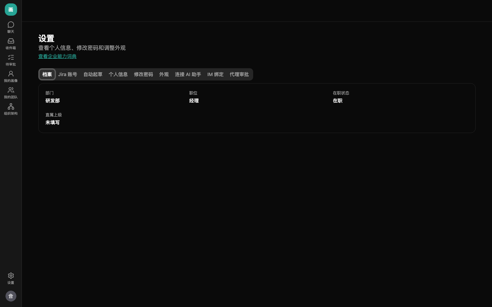

# 经理使用指南

文字已按 M6 更新；截图保留 M4.3 的界面，操作以文字说明为准。

登录后从「待审批」或收件箱进入请求。默认只显示当前由你处理的请求，部门范围包含获授权部门的全部下级部门。本人请求交上级部门经理或企业管理员，管理员与代理人也不能自批。

正式画像通过两种方式改变：经理批准请求（关闭经理确认的能力类别由本人确认后发布为「暂定」），或企业管理员、管辖经理直接修改他人画像并通知本人（E21）。系统自动起草仍先交本人过目；任何人不能批准自己的请求，也不能直接改自己的画像。

## 谁能看到我的画像

| 内容 | 谁能看到 |
| --- | --- |
| 正式画像的能力、等级、状态和陈述 | 本人、管辖经理（含获授权的上级部门经理）、企业管理员 |
| 依据说明和受限自述正文 | 本人和管辖经理；经理在网页审批页查看 |
| 请求中未发布的陈述（含待本人过目、待审、退回等） | 本人、管辖经理；当前实际审批人及有效代理在待审批期间可读该请求 |

管辖范围包括获授权部门及全部下级部门，直属上级关系本身不授予部门权限。管理员身份本身不能读受限正文，兼任本人或管辖经理时按该身份授权。助手工具不提供下属的依据、受限正文和来源，需到网页审批页查看。查看不通知本人，也不留应用内查看记录；直接修改发布后通知本人。代理审批的临时读取例外见下文。

以上为在职员工规则。企业管理员如果既不是本人、管辖经理，也不是该待审请求的实际审批人或有效代理，不能读未发布的陈述；部分批准只放行已批准项，其余仍隐藏。草稿仍由员工本人编辑、提交。

离职员工的画像和自述归档只读，经理、本人和其他非管理员均不可见，也不再出现在团队及助手、飞书、MCP 的团队查询中。只有企业管理员可看归档的能力、等级和状态；受限自述和经理评价正文即使管理员兼任部门经理也不显示。离职时账号停用，未处理请求自动撤回，不能继续审批；恢复在职不会自动恢复这些请求。

数据保存在本企业自己部署的服务器上；存放位置、备份和保留期限请问企业管理员。

## 助手与我的团队

登录后进入三栏助手界面：图标导航、会话列表、对话区。导航包含聊天、收件箱、待审批、我的画像、我的团队和组织架构，底部是设置。模型不可用时，手工页面仍可用。本人画像编辑、材料上传及设置内容见[员工指南](employee-guide.md)。

「我的团队」列出服务器允许查看的人员，包含获授权部门及全部下级部门；列表和手机卡片都显示工号，下属画像标题也显示工号，同名时先核对。「初始画像」列区分等待工作记录、等待起草、待本人过目、未生成判断、「本人已过目」和「经理或管理员已直接修改」等状态；直接修改不代表员工已过目，仅提交本人补充也不算初稿已过目，是否发布仍看审批状态。兼任企业管理员时从「员工」查看同一列。本人档案（含工号）、Jira 账号、自动起草等移到设置，下属档案仍由管理员维护。

点击下属画像的能力名称先打开「能力详情（只读）」，展示完整陈述、等级、状态和北京时间的最近更新时间；依据和来源在网页审批时查看。需要改动时再点独立的「直接修改」。未定级的已发布判断显示陈述摘要，单列「未定级」，不计入「已确认」项数；结合陈述辨别否定和仅协助的含义。

词典缺少能力时，可在「添加能力」搜索无结果后「建议新增这项能力」，以你本人的身份建议，不会替下属修改画像。也可在网页或飞书助手中先核对建议内容并明确同意，交管理员处理；每人最多五条待处理。超时、附件复用、未保存输入保护和底部「退出登录」用法与[员工指南](employee-guide.md)一致。

## 按能力找人

从导航「找人」进入「按能力找人」（`/find-people`）。只有部门经理和企业管理员可用：经理查询获授权部门及全部下级部门的在职员工，管理员查询本企业在职员工。直属上级关系和临时代审不会扩大找人范围。

1. 选择「能力（必选）」，按需选择「最低等级」和「部门（含下级）」。等级顺序采用这项能力的词典等级说明。
2. 可选「判断状态」、最近证据起始／结束日期；状态不选则不限。企业启用时，还会显示岗位序列、工作地点、入职起始／结束日期。
3. 勾选「只看把这项能力列为对应能力的部门」可按部门对应能力限制结果，包括从上级部门继承的能力。
4. 点「查找」，核对结果中的陈述、等级、状态、证据数、最近证据时间、批准人和批准时间，点员工姓名进入画像。

按最低等级筛选时默认不匹配未定级的判断；勾选「包含未定级」后仍会包含这些已发布陈述。没有设置最低等级时，未定级判断本来就可匹配。最近证据时间只计算仍有效的证据。找人结果不提供证据标题、原文、依据说明或受限正文，需要审批依据时到有权访问的网页审批页查看。

**未知不等于不会**：没有已发布判断的人不会出现在结果里，查不到不能据此认定员工不会；只有 Jira 支持的判断最多为「暂定」。找人只提供只读信息，不判断空闲时间，也不发起调配或用于绩效评分。

### 在助手和 MCP 中找人

网页或飞书的员工／经理助手可以接受「找最近十二个月有证据、能独立完成某项工作的人」这样的请求。说明能力、最低等级、时间范围等条件，核对助手返回的陈述和状态，再打开画像链接。此助手只按部门经理管辖范围找人，普通员工不能借它查询团队；只有企业管理员身份、没有部门管辖授权时，也不能使用此助手的找人工具。管理员查询全企业请用「找人」页或 MCP。

外部 MCP 客户端使用 `find_people`，与网页共用筛选和权限规则，需要能力 key，可先读取企业词典。连接方式见[员工指南](employee-guide.md#通过外部-ai-助手更新画像)。管理助手的职责仍是企业管理，找人请用「找人」页或员工／经理助手。

## 需求与容量

企业管理员在「能力与规则 → 需求与容量」开启后，导航才出现「需求与容量」（`/capacity`）。其中有「我的负荷」「我的分配」「团队负荷」「我提的需求」「收到的需求」，按本人身份显示。关闭模块后入口和工具消失，记录保留，画像不受影响。

下文 A 是提需求的部门，B 是目标、承接部门。管辖范围仍包含获授权部门及全部下级部门。即时参考只描述当前部门汇总，不是为某个未来月份预留的人手，更不是承诺。

### A 方：问一问、提需求、回应答复

在网页或飞书的员工／经理助手中，可以说：「帮我问开发部下个月能否接接口开发，需要 2 人，每人投入 50%，先看参考。」助手可返回达到所需能力和最低等级的人数，以及有余量、基本满、超负荷、未确认的人数，不提供 B 员工的姓名、工号、个人画像、个人负荷或分配名单。没有已发布能力判断的人不会计入，未知不等于不会；未确认负荷也不等于有空。

要正式提需求，说清需求方部门、目标部门、能力、最低等级、人数、每人投入比例、时间窗口和说明。核对助手预览卡，需改动就继续对话修改，点「确认」才提交；AI 的文字不代表已经提交。也可直接用网页：

1. 进入「需求与容量 → 我提的需求」，点「问一问 / 提需求」。
2. 选择「需求方部门」「目标部门」「能力」和可选的「最低等级」。目标不能是需求方部门本身；页面同时显示「即时参考」。
3. 填人数（1–50）、每人投入比例（10%–100%）、时间窗口开始／结束和需求说明（最多 2000 字）。经理在管辖范围选需求方部门，普通员工只能用本人部门。
4. 点「预览需求」，核对部门、能力、等级、工作量和日期；需要改时点「返回修改」，再点「确认提交需求」。需求变为「待答复」。

收到通知后，从收件箱点「查看需求与容量」，到「我提的需求 → 查看详情」看「事件时间线」。答复会列出结论、最早开始和承诺完成日期、答复人及「部门级依据（答复时）」。这是答复时的汇总快照，不是当前实时负荷。

| 情况 | 可以做什么 |
| --- | --- |
| 待答复 | 等待 B 方，或点「撤回需求」 |
| 已答复为「能做」「能做一部分」 | 核对日期和说明，点「接受答复」；或填「追问内容」后点「发送追问」；也可撤回 |
| 已答复为「暂时不能」 | 可以追问或撤回，不能接受 |
| 已接受、已撤回 | 不能再追问或撤回；已接受的工作由 B 方分配和处理延期 |

追问会回到「待答复」，等 B 方重新确认，旧答复留在时间线。发起人或管辖需求方部门的经理可回应，不能代替其他无权部门操作。助手中也可要求接受、追问或撤回，每次仍要核对确认卡；出现内容已变化的提示时，刷新详情、重新核对后再操作。

### B 方：看依据、起草并确认答复

在「需求与容量 → 收到的需求」打开待答复需求。目标部门的管辖经理或企业管理员可以代表 B 答复；通知优先发给离目标部门最近、有经理的部门层级。

1. 核对需求的能力、最低等级、人数、每人投入和日期。在「本部门依据」查看达到要求的人员姓名、等级、Jira 参考值、经理确认值和负荷档位；名单按姓名排列。
2. 在网页或飞书助手中说「请读取这条需求和本部门依据，起草一个答复，先不要发」。AI 可以建议「能做」「能做一部分」「暂时不能」及日期和说明。
3. 检查依据和实际安排，在对话里修改答复。核对「答复部门需求」卡后点「确认」才发出，AI 不能替你确认承诺。

不用 AI 时，在同一需求详情的「答复需求」表单选择「答复结论」，填写「最早开始日期」「承诺完成日期」「答复说明」，点「确认发送答复」。「能做」「能做一部分」必须填完整起止日期；「暂时不能」可不填日期，填时须成对且结束不早于开始。

答复会发给 A 方，**不要写本部门员工姓名、工号或个人信息**。服务端会拦截含 B 员工姓名的答复；如同名或常见词被误拦，请改写为部门层面表述。答复依据由系统提交时重新计算为部门级汇总，不把本部门个人名单发给 A 方。代表部门答复的人的姓名会显示在时间线。

已答复后等待 A 接受或追问；只有回到「待答复」才能再答复。需求、答复和日期变更保留时间线与审计。站内通知可从收件箱查看；已启用并绑定飞书时也会推送，通知不代替实际确认。

### B 方：部门内分配和完成日期

A 方接受答复后，在「收到的需求 → 查看详情 → 部门内分配」操作，助手和 MCP 目前没有本模块的分配、直接改日期或审批工具。

1. 在「新增分配」里「从依据中选择员工」，填「投入比例（%）」（10%–100%）和「预计完成日期」，点「确认分配」。网页候选来自本部门依据，须在 B 及其下级部门、本人有权查看的在职员工范围内。
2. 初次分配的完成日期不能晚于当前承诺完成日期。同一需求同一人只能有一条进行中的分配，员工收到通知，在「我的分配」查看。
3. 有管辖权限的经理可在进行中的分配下点「标记完成」或「取消分配」，结束后这条投入不再计入负荷；M6 不自动回流画像。
4. 直接改日期时，在「修改完成日期」填写「调整后的完成日期」，点「保存完成日期」，改后通知员工。已完成或取消的分配不能继续修改。

进行中的分配投入会加到经理确认的平台外其他工作占比上。若其他工作占比尚未确认，总值仍显示「未确认」；先到「团队负荷」确认其他工作，避免把未知当空闲。分配由经理选择，不做自动派活或个人负荷排名。

### 延期审批与对外承诺

员工在「我的分配」申请延期，也可在助手里说明新日期和原因、核对后确认提交。经理在「需求与容量 → 团队负荷 → 延期审批」看当前完成日期、申请完成日期、对外承诺和原因，选择「同意」或「退回」；退回必须填「处理说明」，再点「同意延期」或「退回延期」。

审批沿用当前审批路由，任何人不能批自己的申请。延期的审批人和代理人还必须是 B 及其下级部门的在职成员，或 B 的有权代表（管辖经理或企业管理员）；不是任意企业成员都能代理。代理关系不授予 A 方读取 B 员工姓名和延期原因的权限。代理到期、授权撤销后，不能靠历史审批身份继续读申请。

经理直接改日期或同意延期时，如果新完成日期晚于 B 对 A 的承诺，页面提示「将推迟承诺，保存后会通知对方部门」。必须同时填「新的承诺完成日期」和「给对方部门的说明」；新承诺不能早于各项进行中分配的完成日期，说明不能含 B 员工个人信息。

推迟对外承诺须由有权代表 B 的经理或管理员确认。只有内部审批权的代理人无法代替 B 确认新承诺，应请 B 的有权代表处理。内部日期、新承诺、时间线和通知同时保存，不能只改内部日期而让 A 继续看到旧承诺。A 方收到通知后在需求时间线查看「承诺日期变更」及新日期。

### 团队负荷与负荷调整申请

「团队负荷」按部门、姓名展示管辖范围内在职员工，可用「部门筛选」。Jira 参考值是已同步的未完成指派任务**件数**；经理确认值是**百分比**，等于平台外其他工作占比加所有进行中平台分配投入。件数不换算成百分比，两个数不相加；没有关联 Jira 显示「无」，同步过旧时参考也可能过旧。

| 经理确认值 | 档位 |
| --- | --- |
| 低于 80% | 有余量 |
| 80%–100%（含边界） | 基本满 |
| 高于 100% | 超负荷 |
| 其他工作占比从未确认 | 未确认，不等于零 |

这是当前进行中工作的汇总，不按需求的未来时间窗口拆分。负荷不是绩效，不打分、不排名，也不采集 Jira 工时。

直接调整时，在员工行点「调整」，填「其他工作占比（%）」（0–200%，整数），可填「调整说明」，点「确认调整」。这里填的是平台外工作的占比，不要再把平台内分配重复算进去。例如其他工作 40% 加平台分配 30%，经理确认值为 70%。改后通知本人；经理不能直接调自己，管理员身份本身也不授予直接调整权。

员工的申请在「待处理的调整申请」里，先核对申请值和原因，再点「同意」或填写处理说明后「退回」。同意后更新其他工作占比并通知本人；退回不改负荷，员工可重新申请。每人同时最多一条待处理的调整申请。

负荷申请沿用已有审批路由：有部门授权的直属上级优先，否则沿部门向上找经理，再由管理员兜底，有效代理可处理但不能自批。代理在「个人设置 → 代理审批」设置；团队页仅在有部门管辖授权时展示申请审批区，纯员工代理或仅有管理员身份时没有该区。延期另有上文的 B 部门限制，不能混同。

本人负荷与延期申请也可以在网页／飞书助手或 MCP 发起；内置助手写操作必须点确认卡，MCP 必须先由本人明确同意。批准、分配、直接调整和改日期仍在网页做，模型不可用时表单照常使用。工具与接入见 [MCP 说明](mcp-clients.md#需求与容量工具)。

## 我的团队上方的画像覆盖率

「我的团队」（`/employees`）上方显示「画像覆盖率」，统计当前可见范围内的在职员工：已发布、存在争议、待本人过目、待审批、未知的人数与占比。它按每人的当前审核状态归类，每人只计一类，并非能力项数或能力高低评分；有已发布版本的人也可能因新请求计入待本人过目或待审批。

下方同时显示「初始画像超期未过目」和「等待审批超过 7 天」的请求数。过目期限按企业审批规则，不是固定十四天；请求数不等于员工人数。经理看不到企业 Jira 同步失败信息。

展开「按部门查看（仅本部门在职员工，不含下级汇总）」可比较各部门人数和状态。点部门按钮筛选下方名单，点「全部可见部门」恢复名单；上方总数仍是全部可见范围。未分配部门的员工计入总人数，不会单列部门。

## 导出已发布画像

在「找人」页点「导出已发布画像（CSV）」或「导出已发布画像（JSON）」。导出本人可见范围内全部在职员工的已发布判断，**不受当前页面筛选或分页影响**。离职员工、没有已发布判断的员工，以及当前词典已移除的能力不导出。

每行一条判断，包含工号、能力 key 和名称、等级、判断状态、有效证据数、最近证据时间、批准人和批准时间；未定级判断也会导出。不含陈述、证据标题、原文、依据说明或受限正文。没有结果时 CSV 只有表头，JSON 为 `[]`。

每次成功下载会写导出审计。文件应按企业数据管理要求保管；CSV 使用 UTF-8 BOM，导入 Excel 时将工号设为文本以保留前导零。字段、特殊工号处理及登录后接口见[已发布画像导出说明](profile-export.md)。该接口只读，不会写回 HR 系统，MCP 没有导出工具。

## 直接修改下属画像

在下属能力卡点「直接修改」，填写陈述和等级，点「预览修改」，核对前后差异后点「确认直接发布」。也可以添加能力或撤回判断。发布无需本人同意，也不走待审批；新增和修改为已确认，撤回后为未知。员工会收到站内通知，已开启飞书推送且绑定时同时收到飞书消息。

在网页助手或飞书私聊可要求列出团队、查看下属画像并整理修改，核对确认卡后点「确认修改」才发布。不能直接改自己、其他企业、范围外或离职员工；同时具有管理员身份时，员工助手仍按管辖范围处理，全企业管理须用管理助手。不能改企业设置、能力词典或部门对应能力。

画像在预览后变化会提示刷新，读取新内容后重新修改。员工对直接修改有异议时重新编辑并提交审批；已有待审请求若引用的判断被取代，需要重提。直接修改不改写证据，改前改后和操作者留在审计中。

尚待本人过目的旧初稿可以继续处理：即使员工直接点提交，也会先展示当前正式值及按企业时区显示的直接修改时间，重新核对后才能送审。员工可移除旧稿项，或修改后重新预览，仍须按企业规则审批。陈述 200 字、各项说明 4000 字、每次 50 条的上限见[员工指南](employee-guide.md#每次改动的输入上限)。

## 逐项决定

1. 查看改动前后、等级、陈述、证据、解释和不确定之处；请求中的长陈述可展开。「只有 Jira 来源」批准后仍为暂定，不能据 assignee 推断员工独立完成工作。
2. 每项选择批准、退回修改或拒绝。退回和拒绝必须写原因；可留整体意见。
3. 点「核对并提交」，检查复述的逐项决定，再点「确认提交决定」。内容变化时重新加载核对。

批准项在同一事务中生成新判断与画像版本。部分批准立即发布，退回项另建员工草稿；请求卡按逐项结果汇总，如「1 项批准、2 项退回」，助手查询也按此说明。意见作为受限经理评价证据保留。员工可在「已处理请求」查看逐项原因，对拒绝项点「申诉」，由管理员处理；争议标记不改写旧判断。

提交决定后，该请求会立即从待审批列表移除，可返回列表打开下一条；已处理或无权审批的详情会说明原因并提供返回入口。员工的提交预览和待审批请求中显示当前审批人及身份，代理人和原审批人可同时列出。

审批详情显示「分配原因」：直属上级同时是管辖部门经理时优先交给他，否则找本部门或上级部门经理，都没有时交企业管理员。有效代理显示代谁审批及原审批人的分配原因；这些说明不改变审批权限。

值班经理即使是直属上级，没有部门经理授权也不会因此得到团队查看或审批权。「设置 → 个人信息」会列出本人无权审批的直属下属及当前审批人；助手和飞书也会解释去向，需要授权请找企业管理员。本人已经有该下属审批权时不显示这段提示，选人规则不变。

当前获授权审批人（含代理人、兜底管理员）在待审批期间可读请求引用的证据原文，以及这份请求主体员工与证据关联的判断，不扩大到其他员工。处理完毕或代理到期、撤销后恢复原权限；代理人只获得当前请求的临时读取权限，不因此获得对方整个部门的访问权。

## 代理审批

到「个人设置 → 代理审批」选择企业内有效成员，填写起止时间并保存。有效期间代理人与原审批人都能处理请求，先提交的决定生效；可随时撤销代理。代理不传递，也不能借代理批准自己的请求。

## 在网页助手审批

可以问「有什么要我批的」，说明逐项决定与原因，核对「审批决定复述」卡上的能力、等级和决定，点「确认决定」。点「去审批页查看证据」可读本次审批有权查看的依据，助手卡不展示受限正文。文字和模型输出不能代替确认；内容变化时重新读取。网页助手记来源为网页，批准与发布在同一事务内完成。

## 用 MCP 或 IM 审批

外部 AI 助手按[员工指南](employee-guide.md#通过外部-ai-助手更新画像)连接 MCP，企业管理员需先开启。经理工具包括 `list_pending_reviews`、`get_review`、`decide_review_items`、`get_team_overview` 和只读的 `find_people`。让助手先列出改动及决定，明确同意后才提交；记录来源为 MCP 和客户端名称，只能按你当前的审批权操作。

飞书、企业微信、Telegram 需先绑定。私聊问「有什么要我批的」，说清每项决定及原因；核对审批复述卡片后点「确认决定」。文字回复和模型输出不能代替按钮。需要改动时点「继续修改」，卡片过长或需读受限原文时进入网页。记录来源为 IM 和平台名称。

三个 IM 平台目前仅以假服务验证，真实权限、可见范围及卡片显示由管理员试运行核实。

## 组织架构

从导航栏「组织架构」进入只读架构图，查看授权部门及下级的层级连线、经理和人数，可折叠下级部门。点部门查看汇报树，点人员查看上级链、本人和直接下属；「查看详情」进入员工详情，面包屑返回部门层级。汇报环显示「汇报线有循环」，大图可横向和纵向滚动。范围由服务器按当前授权计算。代审权限只临时用于当前请求，不会扩大架构图范围。

部门改名、移动和删除由企业管理员操作，经理页面不显示编辑按钮。移动部门后，原上级和新上级经理的管辖范围按新层级立即重算，继承的对应能力也会变化；移动子树内已有的直接部门经理授权保留。
